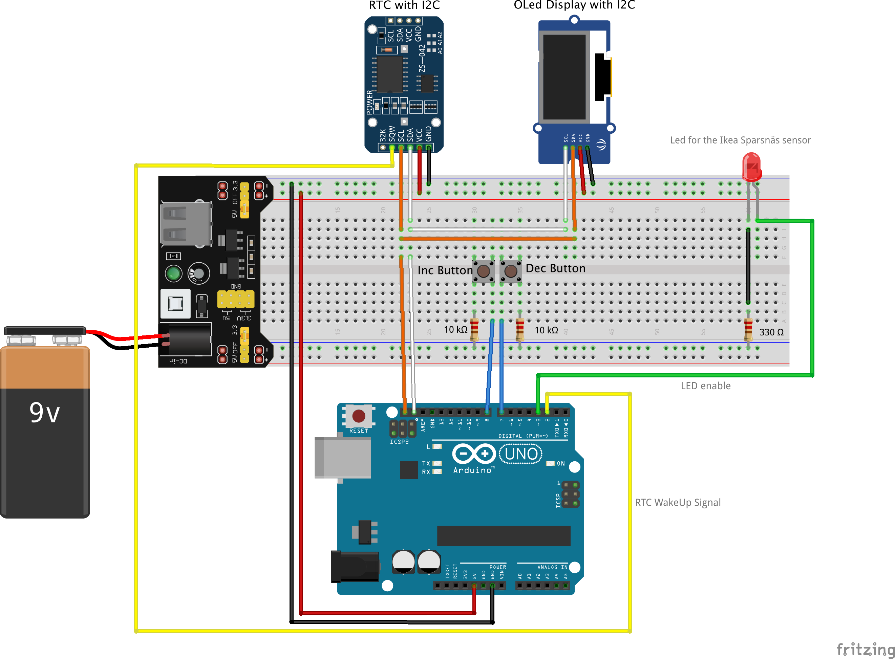
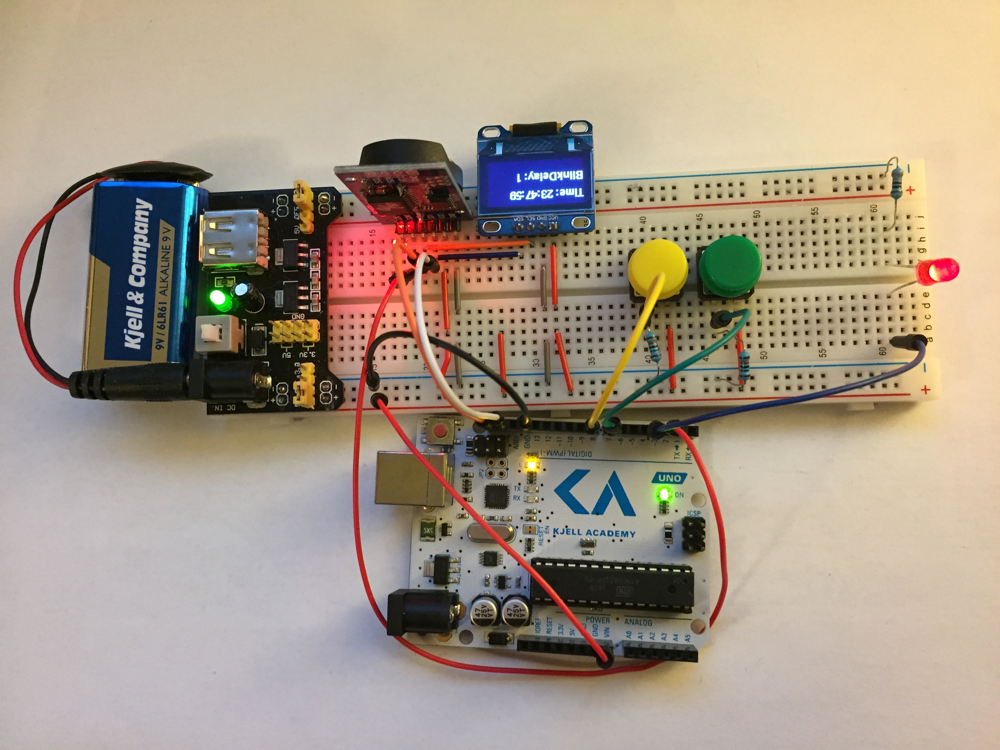

# IKEA Sparsnäs

<!-- TOC -->

- [IKEA Sparsnäs](#ikea-sparsn%C3%A4s)
- [Introduction](#introduction)
    - [The sending sensor](#the-sending-sensor)
- [Radio Signal Analysis](#radio-signal-analysis)
    - [Recording the signal](#recording-the-signal)
    - [Open the recorded signal file in a graphical interface for analysis](#open-the-recorded-signal-file-in-a-graphical-interface-for-analysis)
    - [Verifing our work so far](#verifing-our-work-so-far)
    - [Use Yard Stick One with RfCat to capture packets](#use-yard-stick-one-with-rfcat-to-capture-packets)
- [Packet content analysis](#packet-content-analysis)
    - [Constants](#constants)
    - [Variables](#variables)
    - [Led blink helper tool](#led-blink-helper-tool)
    - [Experiment 1: Finding counters](#experiment-1-finding-counters)
        - [Review of how XOR works](#review-of-how-xor-works)
        - [Applying what we now know about XOR to our own data](#applying-what-we-now-know-about-xor-to-our-own-data)
        - [Look for repetitions in the XOR-data](#look-for-repetitions-in-the-xor-data)
    - [Experiment 2: Controlling input data](#experiment-2-controlling-input-data)
        - [Initial observations](#initial-observations)
        - [Power cycling](#power-cycling)
        - [Figuring out the last byte in the XOR-key](#figuring-out-the-last-byte-in-the-xor-key)
        - [Default value assumption](#default-value-assumption)
    - [Summary of the packet content analysis](#summary-of-the-packet-content-analysis)
        - [The XOR-Key algorithm](#the-xor-key-algorithm)
        - [Writing the packet decoder](#writing-the-packet-decoder)
    - [Finding the XOR-Key for any device](#finding-the-xor-key-for-any-device)
        - [Applying the XOR-Keys to all our sensors](#applying-the-xor-keys-to-all-our-sensors)
- [SPI signal analysis](#spi-signal-analysis)
    - [Soldering probes](#soldering-probes)
    - [Recording the signals](#recording-the-signals)
    - [Studying the CC115L datasheet](#studying-the-cc115l-datasheet)
    - [Decoding the SPI stream](#decoding-the-spi-stream)
    - [SmartRF Studio](#smartrf-studio)
    - [SPI analysis of the receiving display](#spi-analysis-of-the-receiving-display)
- [Build a hardware receiver using a CC1101](#build-a-hardware-receiver-using-a-cc1101)
    - [Build list](#build-list)
    - [Source code](#source-code)
- [Ideas for the future](#ideas-for-the-future)

<!-- /TOC -->

# Introduction

Ikea Sparsnäs is an energy monitor which aim is to monitor electricity usage. It consists of two parts; a sensor and a display:


It uses a Texas Instruments CC115L transmitter, and the display-enabled receiver uses a Texas Instruments CC113L. 

 * [Texas Instruments CC115L](Docs/TexasInstruments.CC115L-RF.Transmitter.On.Sensor.pdf) - Transmitter datasheet
 * [Texas Instruments CC113L](Docs/TexasInstruments.CC113L-RF.Receiver.On.Display.pdf) - Receiver datasheet
 
(The CC-series is originally a ChipCon product, and came into the TI-line back in 2006 when Texas Instruments aquired ChipCon)

## The sending sensor
The sensor consists of a led impulse sensor connected to a Texas Instruments [MSP430G2433](Docs/TexasInstruments.MSP430G2433-MicroController.On.Sensor.pdf) micro-controller (packaged as a 20-TSSOP), where the sensor data is processed. Every 15'th second, the micro-controller sends the collected sensor data via [SPI](https://en.wikipedia.org/wiki/Serial_Peripheral_Interface_Bus) to the CL115 RF-transmitter, which broadcasts the data wireless to the receiving display.


# Radio Signal Analysis
This section describes how to decode the radio transmission.

## Recording the signal

First, you need to have some sort of Software Defined Radio (SDR) installed on your system. There are many out there; [RTL-SDR](https://www.rtl-sdr.com/rtl-sdr-blog-v-3-dongles-user-guide/), [HackRF-One](https://greatscottgadgets.com/hackrf/), [AirSpy](https://airspy.com/products/) just to name a few.


Second, you need some software to record the signal. You will find alternatives ranging from simple commandline apps to more advanced guis. Here are a few alternatives you can use. The Ikea Sparsnäs sends a signal on the 868 MHz band:

```
rtl_sdr -f 868000000 -s 1024000 -g 40 - > outfile.cu8

hackrf_transfer -r outfile.cs8 -f 868000000 -s 2000000

osmocom_fft -a airspy -f 868000000 -v
```

This text will not go into the details on how to install the software. This text will continue assuming that you managed to record a signal to file on disk using one of the command lines above. Note: different applications stores the signal data in different formats such as `*.cu8`, `*.cs8`, `*.cu16`, `*.cfile`, etc. Common to all these formats is the sample form called ["IQ"](http://whiteboard.ping.se/SDR/IQ). [Here](https://arachnoid.com/software_defined_radios/) is another IQ resource.


If you have never worked with signal analysis before, you can check out Mike Ossmann's introduction tutorials on the Yard Stick One: [Part 1](https://www.youtube.com/watch?v=eVqIe3na_Zk) and [Part 2](https://www.youtube.com/watch?v=vf38-8LbDuw).

## Open the recorded signal file in a graphical interface for analysis

 There are many different techniques and softwares for doing signal analysis. Here we will be using [Inspectrum](https://github.com/miek/inspectrum) and [DspectrumGUI](https://github.com/tresacton/dspectrumgui).

```
 inspectrum -r SampleRateInHz Filename.Ext
 inspectrum -r 1024000        outfile.cu8
```

Now begins the process of locating the signal. Browsing the horizontal timeline we finally find the following colorful signal:


By modifying the sliders on the left in the GUI, we can zoom in into the signal. The Y-axis is the `FFT size` and the X-axis is the `Zoom` which corresponds to the timeline of your signal recording. By doing this, we end up with the following result:


The recording frequency of 868 MHz is represented at zero on the Y-axis. The short signal in the middle is an artifact called `DC-Spike` which is an anomaly generated by the SDR-device. But here we see two frequencies along the recording frequency. This is typical for signal modulation type ["FSK"](https://en.wikipedia.org/wiki/Frequency-shift_keying). Let's zoom in even further:


Now this certainly looks like a FSK-signal.

By right-clicking on the FSK-signal in Inspectrum we can do a "Frequency Plot":


The frequency plot (see the green-lined graph above) show how the two frequencies changes and creates binary 1's and 0's. Right-clicking on the frequency plot graph enables us to do a "Threshold Plot" which modifies the somewhat buzzy frequency plot into a nice binary form:


Next up in the analysis is to determine signal characteristics like data rate of the 1's and 0's. Inspectrum helps us with that by using "cursors" which are enabled by hitting the checkbox on the left in the gui. We can here graphically position the cursors such that they align as perfectly as possible with the edges of the 1's and 0's. We do this for as long as we have what seems as valid data, ending up with 208 symbols (i.e. 1's or 0's).


Now, if we look in the reference documentation of the transmitter CC115L, we find this packet description:


So, our green binary bit-stream should fit into this packet.

Working with binary streams can be inefficient. A more preferable form is hexadecimal. We could start counting the binary string, 8-bits at a time, but instead we use the application DspectrumGui which automates that process for us. Right-click and send the data to stdout. (For this to work it is required that you have started Inspectrum from within DspectrumGUI).


Here in DspectrumGUI we see the binary stream and the "Raw Binary To Hex" conversion. Now its easier to map the data into the packet format:


## Verifing our work so far

We now want to verify that our analysis is correct. We do this by looking up the CRC-algorithm in the Texas Instruments documentation and test our values:


We do a quick implementation of the algorithm in an online C++ compiler/debugger environment, and when executing it we end up with "crc checksum: 0x1204" which matches the expected crc value.

## Use Yard Stick One with RfCat to capture packets
We can now go on to the next step in the analysis which is recording more data. Now since the sender and receiver are part of the Texas Instruments family CCxxxx, we use a usb hardware dongle called ["Yard Stick One"](https://greatscottgadgets.com/yardstickone/). It consists of a CC1111 chip which can be controlled using the Python-library RfCat.

To start doing this, we need to feed the things we have seen so far in the analysis into the CC1111-tranceiver. The screen below demonstrates how to retrieve all the necessary values.


By starting RfCat, defining the function init(d) and calling it we have configured the CC1111-chip. To start listening we call d.RFlisten() and as you can see we start to get some packets.

However, to be able to test the packet content better, we write a small Python script. Take a moment to read it, in order to get an understanding of what's going on:

```python
#=============================================================================
# Ikea Sparsnas packet decoder using Yard Stick One along with RfCat
#=============================================================================
import sys
import readline
import rlcompleter
readline.parse_and_bind("tab: complete")
from rflib import *                           

#-----------------------------------------------------------------------------
#------------------------------ Global variables -----------------------------
#-----------------------------------------------------------------------------
d = RfCat()
Verbose = False


#-----------------------------------------------------------------------------
# Initialize radio
#-----------------------------------------------------------------------------
def init(d):
    d.setFreq(868000000)            # Main frequency
    d.setMdmModulation(MOD_2FSK)    # Modulation type
    d.setMdmChanSpc(40000)          # Channel spacing
    d.setMdmDeviatn(20000)          # Deviation
    d.setMdmNumPreamble(32)         # Number of preamble bits
    d.setMdmDRate(38391)            # Data rate
    d.setMdmSyncWord(0xD201)        # Sync Word
    d.setMdmSyncMode(1)             # 15 of 16 bits must match
    d.makePktFLEN(20)               # Packet length
    d.setMaxPower()

#-----------------------------------------------------------------------------
# Crc16 helper
#-----------------------------------------------------------------------------
def culCalcCRC(crcData, crcReg):
    CRC_POLY = 0x8005
    
    for i in xrange(0,8):
        if ((((crcReg & 0x8000) >> 8) ^ (crcData & 0x80)) & 0XFFFF) :
            crcReg = (((crcReg << 1) & 0XFFFF) ^ CRC_POLY ) & 0xFFFF
        else:
            crcReg = (crcReg << 1) & 0xFFFF
        crcData = (crcData << 1) & 0xFF
    return crcReg

#-----------------------------------------------------------------------------
# crc16
#-----------------------------------------------------------------------------
def crc16(txtBuffer, expectedChksum):
    CRC_INIT = 0xFFFF
    checksum = CRC_INIT

    hexarray = bytearray.fromhex(txtBuffer)
    for i in hexarray:
        checksum = culCalcCRC(i, checksum)

    if checksum == int(expectedChksum, 16):
        #print "(CRC OK)"
        return True
    else:
        #print "(CRC FAIL) Expected=" + expectedChksum + " Calculated=" + str(hex(checksum))
        return False

#-----------------------------------------------------------------------------
# "main"
#-----------------------------------------------------------------------------
print "Initialize modem..."
init(d)

print "Waiting for packet..."
#d.RFlisten()

#-----------------
# Read packet loop
#-----------------
while True:
    capture = ""
    
    #---------------------------------
    # Wait for a packet to be captured
    #---------------------------------
    try:
        y,z = d.RFrecv()
        capture = y.encode('hex')
        #print capture

    except ChipconUsbTimeoutException:
        pass

    #------------------------
    # When we get a packet...
    #------------------------
    if capture:

        # Extract packet content to the formal TexasInstruments packet layout
        pkt_length  = capture[0:0+2]
        pkt_address = capture[2:2+2]
        pkt_data    = ""
        for x in xrange(4, len(capture) - 4, 2):
            currElement = capture[x:x+2]
            pkt_data += currElement + " "
        pkt_crc     = capture[36:36+2] + " " + capture[38:38+2]

        # Verify crc16 accordingly to the TexasInstruments implementation
        crcBuf_str  = (pkt_length + pkt_address + pkt_data).replace(" ","")
        expectedCrc = capture[36:36+2] + capture[38:38+2]
        crcOk       = crc16(crcBuf_str, expectedCrc)

        if Verbose:
            print "pkt.length        = " + pkt_length
            print "pkt.address_field = " + pkt_address
            print "pkt.data_field    = " + pkt_data
            print "pkt.crc16         = " + pkt_crc + " (CRC verification: " + str(crcOk) + ")"
            print ""
        else:
            if crcOk:
                print "Pkt: " + pkt_length + " ",
                print  pkt_address + " ",
                print  pkt_data.replace(" ","") + " ",
                print  pkt_crc.replace(" ","")
```

When we run the script and start to get some data, we quickly identify that the packet content does not match what is shown on the receiving display. We can therefore conclude that the packet content is scrambled in some way. However, since the sensor is a small battery powered device with limited computational resources it is a fair assumption that we're dealing with some kind of simplistic XOR obfuscation of sorts, and not power-hungry encryption algorithms.


# Packet content analysis
At this point, we know nothing of the internal packet layout, but we can start to identify some patterns. This is a creative process which can be quite time consuming. First we need to list possible entities that may, or not may, be in the Data Field-part of the signal.

## Constants

 * Variable identifiers (such as data for variable X is always prepended with the constant Y)
 * Length fields (packet length, length of individual fields in the packet, etc)
 * Sync words or other "magics" 
 * Sender identifiers (addresses, serials, hardware or software versions/revisions)
 * etc

## Variables

 * Timestamps
 * Things we (in this case) see on the display
   * Current power usage seen on the display
   * Accumulative power consumption seen on the display
   * Battery life properties
 * Signal strength/RSSI if we're dealing with a two-way communication protocol
 * Extra crc's or other hashes
 * etc

The list goes on an on, but lets start with those elements for now. When identifying element-patterns we need to control the signal being sent as much as possible. Therefore we build a simple led-blinker with an Arduino board. The led is flashing at a predetermined rate which we control. While forcing the stable flash rate we can observe what kWh the led blinks translate into on the receiving display. This is a good starting point for our analysis. Other things we may consider could be to hook up the sensor to a voltage cube and vary the transmitters battery voltage. A third option is to purchase several Sparsnäs devices, and decode signals from the different senders which may have different sender properties or identifiers. 

## Led blink helper tool



You can find the source code [here](LedBlinkerHelperTool/LedFlasher.ino).

We hook up the Sparsnäs sensor to the red led on the right in the image above. Using the yellow and green push buttons we can increase or decrease the delay between led blinks, allowing us to experiment while running our RfCat on the side.

## Experiment 1: Finding counters

In the first experiment, we isolate the sensor in total darkness (using some black electrical tape). Any changing fields would not be related to measured data, but rather to counters such as unique packet identifiers, timestamps etc. In this case, we use a sender with ID 400-565-321 printed on the plastic case, and by looking at the hexdump we can identify some patterns. This listing goes on for a very long time in order to detect static and dynamic values in the hexdump-mass. This enables us to separate values and insert spaces to form columns.

```
 len  ID  Cnt Fix  Fixed    Cnt2 Data Fixed      Crc16
 11   49   00 070f a276170e cfa2 8148 47cfa27ed3 f80d
 11   49   01 070f a276170e cfa3 8148 47cfa27ed3 6e0e
 11   49   02 070e a276170e cfa0 c6b7 47cfa27ed3 be8c
 11   49   04 070f a276170e cfa6 6db7 47cfa27ed3 6a3d
 11   49   05 070f a276170e cfa7 6877 47cfa27ed3 f9a2
 11   49   06 070f a276170e cfa4 6437 47cfa27ed3 4f25
 11   49   07 070f a276170e cfa5 60f7 47cfa27ed3 5da9
 11   49   08 070f a276170e cfaa 5cb7 47cfa27ed3 302e
 11   49   09 070f a276170e cfab 5b77 47cfa27ed3 2192
 11   49   0a 070f a276170e cfa8 5737 47cfa27ed3 9715
 11   49   0b 070f a276170e cfa9 53f7 47cfa27ed3 8599
 11   49   0c 070f a276170e cfae 4fb7 47cfa27ed3 7a1e
 11   49   0d 070f a276170e cfaf 4a77 47cfa27ed3 e981
 11   49   0e 070f a276170e cfac 4637 47cfa27ed3 5f06
 11   49   0f 070f a276170e cfad 42f7 47cfa27ed3 4d8a
 11   49   10 070f a276170e cfb2 3eb7 47cfa27ed3 8408
 11   49   11 070f a276170e cfb3 3d77 47cfa27ed3 11f7
 11   49   12 070f a276170e cfb0 3937 47cfa27ed3 2ff3
 11   49   13 070f a276170e cfb1 35f7 47cfa27ed3 b5fc
 11   49   14 070f a276170e cfb6 31b7 47cfa27ed3 53fb
 11   49   15 070f a276170e cfb7 2c77 47cfa27ed3 d9e4
 11   49   16 070f a276170e cfb4 2837 47cfa27ed3 e7e0
 11   49   17 070f a276170e cfb5 24f7 47cfa27ed3 7def
 ..   ..   .. .... ........ .... .... .......... ....
 ..   ..   .. .... ........ .... .... .......... ....
 ..   ..   .. .... ........ .... .... .......... ....
 11   49   40 070f a276170e cfe2 8ab7 47cfa27ed3 5b53
 11   49   41 070f a276170e cfe3 8977 47cfa27ed3 ceac
 11   49   42 070f a276170e cfe0 8537 47cfa27ed3 782b
 11   49   43 070f a276170e cfe1 81f7 47cfa27ed3 6aa7
 11   49   44 070f a276170e cfe6 8177 47cfa27ed3 082f # Column 'Data' becomes stable
 11   49   45 070f a276170e cfe7 8177 47cfa27ed3 9e2c
 11   49   46 070f a276170e cfe4 8177 47cfa27ed3 a42c
 11   49   47 070f a276170e cfe5 8177 47cfa27ed3 322f
 11   49   48 070f a276170e cfea 8177 47cfa27ed3 e02f
 11   49   49 070f a276170e cfeb 8177 47cfa27ed3 762c
 ..   ..   .. .... ........ .... .... .......... ....
 ..   ..   .. .... ........ .... .... .......... ....
 ..   ..   .. .... ........ .... .... .......... ....
 11   49   7a 070f a276170e cfd8 8177 47cfa27ed3 ec26
 11   49   7b 070f a276170e cfd9 8177 47cfa27ed3 7a25
 11   49   7c 070f a276170e cfde 8177 47cfa27ed3 9826
 11   49   7d 070f a276170e cfdf 8177 47cfa27ed3 0e25
       pkt 7e was lost during signal recording
 11   49   7f 070f a276170e cfdd 8177 47cfa27ed3 a226
 11   49   00 070f a276170e cf22 8177 47cfa27ed3 5302 # Column 'Cnt' wraps
 11   49   01 070f a276170e cf23 8177 47cfa27ed3 c501
 11   49   02 070f a276170e cf20 8177 47cfa27ed3 ff01
 11   49   03 070f a276170e cf21 8177 47cfa27ed3 6902
 11   49   04 070f a276170e cf26 8177 47cfa27ed3 8b01
 11   49   05 070f a276170e cf27 8177 47cfa27ed3 1d02
 11   49   06 070f a276170e cf24 8177 47cfa27ed3 2702
 ```
*(We crop the listing here; hope you get the idea by now)*

* This experiment results in
    * Len = This column matches the number of payload bytes. In the Texas Instruments-case, the payload starts with the column after the length column (namely the 'ID' column) and ends where the CRC16 column begins.
    * ID = The signal analysis we performed in DspectrumGUI (previously) was performed using a different sensor. Here we see that the 2nd byte is changed when we're using the new sensor. We assume that this is some sort of sensor ID, and therefore name the column 'ID'.
    * We find what looks like two counters and name them 'Cnt'. 
        * As for the first, it isn't scrambled and continues to increase until it reaches 0x7F. Then it restarts at 0x00 again.
        * The second 'Cnt2' is scrambled, and its easily mixed with the column next to it named 'Data'. However, when scrolling down until packet 0x45, we see that the 'Data' column stabillizes at '8177'. This makes it very likely we're dealing with two separate columns.
    * The remaining columns contain fixed values and we leave them as is (for now).
    * Another important finding:
        * Power-cycling the sensors' battery, will make the sequences repeat *exactly* as the previous testrun.
        -> This makes our analysis much more doable.

### Review of how XOR works

* We concluded earlier that it is likely that we're dealing with some sort of XOR-obfuscation. Therefore; it is a good time to review the characteristics of the XOR-operation (denoted with the ^ character). Some handy facts:

    * **Fact 01:** Any `byte ^ 0x00` will result in the original value. That is, `0xAA ^ 0x00 = 0xAA`. We can use this fact when identifying counters which starts from zero and then increases. Lets say we have a 32-bit counter (i.e. 4 bytes) which we find it reasonably that is starts from zero, but is XOR'ed with an unknown key:

    | Packet ID  | Clear text before send | XOR'ed data read in the air  |
    | ---------- |:----------------------:| -----:|
    | packet 01  | 00 00 00 00 | 11 22 33 44 |
    | packet 02  | 00 00 00 01 | 11 22 33 45 |
    | packet 03  | 00 00 00 02 | 11 22 33 46 |
    | packet 04  | 00 00 00 03 | 11 22 33 47 |
    | packet 05  | 00 00 00 04 | 11 22 33 40 |

    * Knowing that a number xor'ed with `0x00` results in the original value, we can conclude that the unknown XOR-key for the packets above is `11 22 33 44`.

    * **Fact 02:** How XOR works when dealing with increasing value series in relation to each other. Consider the following set of values:
```
    | Packet ID  | In the air  | Packet 01 XOR with Packet 0* | Packet 01   ^ Current Val = Unscrambled Cnt
    | ---------- |:-----------:| ----------------------------:| -------------------------------------------
    | packet 01  | 11 22 33 44 | --+--+--+--+                 | 11 22 33 44 ^ 11 22 33 44 = 00 00 00 00
    | packet 02  | 11 22 33 45 | <-+  |  |  |                 | 11 22 33 44 ^ 11 22 33 45 = 00 00 00 01
    | packet 03  | 11 22 33 46 | <----+  |  |                 | 11 22 33 44 ^ 11 22 33 46 = 00 00 00 02
    | packet 04  | 11 22 33 47 | <-------+  |                 | 11 22 33 44 ^ 11 22 33 47 = 00 00 00 03
    | packet 05  | 11 22 33 40 | <----------+                 | 11 22 33 44 ^ 11 22 33 48 = 00 00 00 04
```
* In counter series starting with *zero*, xor'ing the start value with the following elements, results in the counter sequence in clear text.

### Applying what we now know about XOR to our own data

Lets assume that the `Cnt2` counter starts at `0x000`. To verify this assumption we do the following operation. Xor the starting value with each following value in the column and see what we get:

```
 len  ID  Cnt Fix  Fixed    Cnt2 Data Fixed      Crc16
 11   49   00 070f a276170e cfa2 8148 47cfa27ed3 f80d
 11   49   01 070f a276170e cfa3 8148 47cfa27ed3 6e0e
 11   49   02 070e a276170e cfa0 c6b7 47cfa27ed3 be8c
 11   49   04 070f a276170e cfa6 6db7 47cfa27ed3 6a3d
 ..   ..   .. .... ........ .... .... .......... ....
 
  cfa2 ^ cfa2 = 0000
  cfa2 ^ cfa3 = 0001
  cfa2 ^ cfa0 = 0002
  cfa2 ^ cfa6 = 0003
  .... ^ .... = ....

  Great, it looks like our assumption is valid. The XOR key for
  those two bytes in the 'Cnt2' colum is definitely 'cfa2'.
```

### Look for repetitions in the XOR-data

We now know that given the value of zero, the xor-key *at some positions* in the dataset is `cfa2`. But if we're lucky, there can be other columns which also begins with the value of zero, but isn't counters. Lets consider the top row:


Can we detect the `cfa2` sequence anywhere else? Well, yes, we seem to have one hit in the last 'Fixed' column. 


If we now make the following assumptions:

    * That last column named "Fixed" also starts with 0x000 (at least at the cfa2 positions).
    * Repeating sequences indicates a rolling XOR-key, where we have a 
      shorter key compared to the longer data to be scrambled.

Lets measure the byte-distance:


We seem to have 5 bytes before the values repeat. In cryptanalysis, what we're doing here is known as [Frequency analysis](https://en.wikipedia.org/wiki/Frequency_analysis). If our assumptions are correct, it means we have a 5-byte long XOR-key.

Lets measure if a 5-byte XOR-key would go fit into the packet. We saw in the long packet dump above, that the three first columns (i.e. Len, ID, Cnt) was most likely in clear text. So, the scrambled data begins with the first 'Fix' column and ends where the Crc16 begins. Attempt to fit a 5-byte XOR-key based on that:


It aligns perfectly, which strengthens our assumption. So, the assumption is now that we have the following XOR-key: ``?? cf a2 ?? ??``

## Experiment 2: Controlling input data

Next up is to use our Arduino-based "Led blink helper tool" we built earlier. We remove the black electrical tape and attach the sensor to the led on the breadboard. Looking at the packet dump above we can very easily conclude that the sensor sends one packet every 15'th second. If we configure our helper-tool to blink once every minute, we would have four packets per blink. (To reduce space I have removed duplicate 'NewCnt' packets. That's why the 'Cnt' & XOR-'PCnt' columns aren't sequential.)

```
Len ID Cnt Fix Fixed    PCnt Data NewCnt      Crc16
 11 49 00 070f a276170e cfa2 8148 47cfa27e d3 f80d
 11 49 02 070e a276170e cfa0 c6b7 47cfa27e d3 be8c
 11 49 04 070e a276170e cfa6 99eb 47cfa27f d3 b625
 11 49 08 070e a276170e cfaa 916f 47cfa27c d3 bc2b
 11 49 0d 070e a276170e cfaf 8ef3 47cfa27d d3 4a4d
 11 49 0f 070e a276170e cfad 9129 47cfa27a d3 5a6a
 11 49 19 070e a276170e cfbb 917d 47cfa278 d3 223c
 11 49 1b 070e a276170e cfb9 9179 47cfa279 d3 e83a
 11 49 22 070e a276170e cf80 9161 47cfa276 d3 0c2b
 11 49 24 070e a276170e cf86 9167 47cfa277 d3 6e2d
 11 49 27 070e a276170e cf85 9161 47cfa274 d3 ce28
 11 49 2c 070e a276170e cf8e 914d 47cfa275 d3 6206
 11 49 31 070e a276170e cf93 8ecf 47cfa272 d3 807b
 11 49 33 070e a276170e cf91 9117 47cfa273 d3 f45f
 11 49 37 070e a276170e cf95 8e83 47cfa270 d3 5830
 11 49 3b 070e a276170e cf99 9101 47cfa271 d3 5848
```

### Initial observations
* The first `fixed` column is now `070e` instead of `070f`. This could be a status-field which indicates that the sensor is receiving led-blinks. One could speculate that either `070e` or `070f` represents a `TRUE/FALSE` value.
* The `NewCnt` and the following value `d3` seems to be two separate columns, since `d3` is constant and `NewCnt` behaves like a 32-bit counter, so we space them apart.

### Power cycling
Now lets pull the battery out and put it back in again. The interesting thing is to determine whether any values are persistent over the power cycle, or if they are being reset back to default values. At the same time, we take our assumption of a 5-byte XOR-key length into account. Watch what happens:

```
First captured packet after power cycling:

Len ID Cnt Fix Fixed    PCnt Data NewCnt      Crc16
 11 49 00 070f a276170e cfa2 8148 47cfa27e d3 f80d
          |-5-bytes-||--5-bytes-| |-5-bytes-|
```
The first packet is identical to the one previous to the power cycling. Now, having determined that the `NewCnt` column is a counter, and its being reset on boot, we can make the assumption that `NewCnt` starts with the value zero. We can test if this assumption is reasonably.
Remember what we stated in "Fact 01" earlier, that is, ``0xAA ^ 0x00 = 0xAA``. This would mean that we have the have the 4 first bytes XOR-key if our assumption is correct. The remaining value `d3` remains to be figured out. Enough, lets test our assumption. (Again; To reduce space I have removed duplicate 'NewCnt' packets. That's why the 'Cnt' & XOR-'PCnt' columns aren't sequential.)

```
Len ID Cnt Fix Fixed    PCnt Data NewCnt      Crc16      Xor-Key      NewCnt      Result
 11 49 00 070f a276170e cfa2 8148 47cfa27e d3 f80d     # 47cfa27e  ^  47cfa27e  = 00000000 
 11 49 04 070e a276170e cfa6 99eb 47cfa27f d3 b625     # 47cfa27e  ^  47cfa27f  = 00000001
 11 49 08 070e a276170e cfaa 916f 47cfa27c d3 bc2b     # 47cfa27e  ^  47cfa27c  = 00000002
 11 49 0d 070e a276170e cfaf 8ef3 47cfa27d d3 4a4d     # 47cfa27e  ^  47cfa27d  = 00000003
 11 49 0f 070e a276170e cfad 9129 47cfa27a d3 5a6a     # 47cfa27e  ^  47cfa27a  = 00000004
 11 49 19 070e a276170e cfbb 917d 47cfa278 d3 223c     # 47cfa27e  ^  47cfa278  = 00000006
 11 49 1b 070e a276170e cfb9 9179 47cfa279 d3 e83a     # 47cfa27e  ^  47cfa279  = 00000007
 11 49 22 070e a276170e cf80 9161 47cfa276 d3 0c2b     # 47cfa27e  ^  47cfa276  = 00000008
 11 49 24 070e a276170e cf86 9167 47cfa277 d3 6e2d     # 47cfa27e  ^  47cfa277  = 00000009
 11 49 27 070e a276170e cf85 9161 47cfa274 d3 ce28     # 47cfa27e  ^  47cfa274  = 0000000A
 11 49 2c 070e a276170e cf8e 914d 47cfa275 d3 6206     # 47cfa27e  ^  47cfa275  = 0000000B
 11 49 31 070e a276170e cf93 8ecf 47cfa272 d3 807b     # 47cfa27e  ^  47cfa272  = 0000000C
 11 49 33 070e a276170e cf91 9117 47cfa273 d3 f45f     # 47cfa27e  ^  47cfa273  = 0000000D
 11 49 37 070e a276170e cf95 8e83 47cfa270 d3 5830     # 47cfa27e  ^  47cfa270  = 0000000E
 11 49 3b 070e a276170e cf99 9101 47cfa271 d3 5848     # 47cfa27e  ^  47cfa271  = 0000000F
```

Well, what a nice counter! Thus, we can (with some certainty) conclude the XOR-key being:
```
    47 cf a2 7e ??
```
Now we only need to figure out the last byte. The bytes affected by the missing XOR-byte are:


Testing an unscramble operation by XOR'ing the first packet with the assumed XOR-key:

```
Len ID Cnt Fix Fixed    PCnt Data NewCnt      Crc16
 11 49 00 070f a276170e cfa2 8148 47cfa27e d3 f80d
          47cf a27e??47 cfa2 7e?? 47cfa27e ??
 -------------------------------------------------
          40C0 0008??49 0000 FF?? 47cfa27e ??
```
The first and last values (``17`` & ``d3``) have been static during our whole analysis so far. This makes them very dificult to work with. However, the byte in the middle column 'Data', containing the value ``48``, has been fluctuating since we started feeding the sensor with led blinks. If we could figure out what this column is used for, perhaps we can solve it. Let summarize what we assumed (and partially know) so far:
  * Len    - Length of payload bytes, starting with column Fix (070f) and ending before the Crc16
  * ID     - Seems to be a sender ID of some sort
  * Cnt    - A 8-bit packet counter, wrapping at 0x7F (which makes it 7-bits actually)
  * Fix    - Some sort of flag/status column with true/false like properies stating if the sensor is detecting any blinks.
  * Fixed  - 5 bytes of static data. At present, it is hard to make something of it.
  * PCnt   - A 16-bit packet counter.
  * Data   - Only modified when we prove led blinks, so it should have something to do with the measurement process.
  * NewCnt - A 32-bit led blink counter. Increases by one for every blink.
  * d3     - At present, it is hard to make something of it.
  * Crc16  - The standard Texas Instruments Crc16

### Figuring out the last byte in the XOR-key
Lets take a step back and reason a little bit. The only two columns which are changed relative to led blinks are `Data` and `NewCnt`. That means they are the only two columns which can affect the Watt-value printed on the receiving display. Now, the `NewCnt` column only measures the total amounts of led blinks. However, the receiving display also shows the *current* power usage in Watts. We should look into the theory of how that works. Infact, this is commonly described as the process of converting led impulses to Watts in modern domestic electricity consumption and microgeneration meters.

There are numerous projects out there describing the mathematics in detail, so we'll keep it short here. 


Example: If the LED flashes once every 5.2 seconds on a meter labeled 800 kWh, the power going through the meter at that time will be 3600 / (5.2 * 800) = 0.865 kW. If we want Watt instead of kW, we multiply by 1024 which yields (3600 * 1024) / (5.2 * 800) = 886 Watt.

Side note: *We have set k=1024 instead of k=1000. As it turns out (which we will see later) the Sparsnas manufacturer have defined k as 1024 when transfering the packets. However, in a generic formula it might have been more correct to write it as k=1000, but that isn't applicable here in our scenario. One can also speculate whether its "cheaper" to shift 10 bits (i.e. k=1024) compared to the multiply/division by 1000, but we won't know that until we dump the flash memory.*

With this in mind, we can make an assumption that the `Data` column should contain the timing information in the fraction-denominator in some form. But to get to this, we first need to figure out the last byte in the XOR-key.

### Default value assumption
In our test-unscramble operation above we received the following result:

```
    Data column: 8148
    XOR-key:     7e??
                 ----
                 FF??
```
When we see `FF` as the highbyte, we can start to reason. We know the lowbyte must be somewhere between `00` & `FF`, right? `FFFF` would translate into `-1` in decimal form, which would be a plausible initialization value. Other values, such as `FF00`, translates into `-256` (or `65280` decimal) which may be valid but seems less likely. So we start with an assumption that the Data column starts with the unscrambled value of `0xFFFF`.

How do we figure out the XOR-key value? Well, this is what we're asking: ``48 ^ ?? = FF``  which in XOR-math translates into ``?? = 48 ^ FF``, which in turn equals ``B7``. 

How do we verify this XOR-key? Well, let us capture some data and investigate it. When we receive a packet, pay attention to the values on the receiving display and write them down. We speed up the blink-rate on the Arduino-connected led to one blink per second in order to get more dynamic values. Here's a few selected lines:

```
Len ID Cnt Fix Fixed    PCnt Data NewCnt     Crc16     Data ^ Key    (Hex) (Dec)   Watt on display
--- -- -- ---- -------- ---- ---- ---------- ----      -------------------------   ---------------
 11 49 1e 070e a276170e cfbc 7aa5 47cfa3aed3 9143    # 7aa5 ^ 7EB7 = 0412  (1042)  3537
 11 49 24 070e a276170e cf86 7aa3 47cfa054d3 a17f    # 7aa3 ^ 7EB7 = 0414  (1044)  3531
 11 49 45 070e a276170e cfe7 7aa7 47cfa667d3 bd13    # 7aa7 ^ 7EB7 = 0410  (1040)  3544
```

Now, we can verify our assumptions so far by putting the received (and unscrambled) data into the mathematical formula defined above:

```
Power (W)  = (1024) * (60 * 60) / (the seconds between flashes * number of Imp/kWh printed on meter)
           = (1024) * (60 * 60) / (unscrambled value sent in the 'Data' column)
           = 3686400            / (unscrambled value sent in the 'Data' column)

===>

Power (W) = 3686400 / 1042 = 3537
Power (W) = 3686400 / 1044 = 3531
Power (W) = 3686400 / 1040 = 3544
```

These values match what we have seen on the receiving display, and thus we can consider our assumptions verified.


## Summary of the packet content analysis
Knowing the scrambling scheme, we only need to capture the **first packet after power-cycling** the sensor. This will enable us to determine the XOR-key as described below. We also attempt to rename the columns:


### The XOR-Key algorithm
1. Capture the first packet after power cycling the sensor.
2. Copy the content from the "PulseCnt" column.
3. Take the last byte from the "AvgTime" column and XOR it with ``0xFF``. Then append the result as the last byte in our XOR-Key.

Applying that XOR-key then yields:

```
Len ID Cnt Status Fixed    PCnt AvgTime PulseCnt ?? Crc16
 11 49 00 070f    a276170e cfa2 8148    47cfa27e d3 f80d   <--- Packet data
          47cf    a27eb747 cfa2 7eb7    47cfa27e b7        <--- XOR key
 -------------------------------------------------
          40C0    0008A049 0000 FFFF    00000000 64        <--- Unscrambled result
```


To summarize what we have found out of the packet content:

| Column   | Description | 
| --------: |:------------- | 
| Len      | Length of payload bytes, starting with column Fix (070f) and ending before the Crc16 | 
| ID       | Seems to be a sender ID of some sort | 
| Cnt      | A 8-bit packet counter, wrapping at 0x7F (which makes it 7-bits actually) | 
| Status   | Some sort of flag/status column with true/false like properties stating if the sensor is detecting any blinks. | 
| Fixed    | 5 bytes of static data. At present, it is hard to make something of it.  | 
| PCnt     | A 16-bit packet counter. | 
| AvgTime  | Average time between pulses which can be used to calculate current power usage using the formula: 3686400 / (unscrambled value sent in the 'Data' column). Note: This is a simplified form for energy meters using 1000 impulses per kWh. If your meter is using other values, you need to use the formula in its original form as discussed above. | 
| PulseCnt | A 32-bit led blink counter. Increases by one for every blink. | 
| d3       | At present, it is hard to make something of it. | 
| Crc16    | The standard Texas Instruments Crc16 | 

### Writing the packet decoder

This enables us to write a small and simple Python-script to decode the signal:


The source code can be found [here](Receiver.using.RfCat/sparsnas_rfcat.py).

## Finding the XOR-Key for any device

I took the opportunity to shop when there was a sale at the local store. 


Now comes a repetitive job; for each sensor, capture the first (scrambled) packet after battery insertion. To do this we use our RfCat-script we wrote earlier, which also highlights differences using colors. The source code is [here](Receiver.using.RfCat/sparsnas_rfcat_raw.py). This is what the capture looked like:
```
| S/N          | Len | ID | Cnt | Status | Fixed    | PCnt | AvgTime | PulseCnt | d3 | Crc16 | XOR-Key (applying our algorithm) |
| -----------: | :-- | :- | :-- | :----- | :------- | :--- | :------ | :------- | :- | :---- | :------------------------------- |
| 400 565 321  | 11  | 49 | 00  | 070f   | a276170e | cfa2 | 8148    | 47cfa27e | d3 | f80d  | 47 cf a2 7e b7                   |
| 400 595 807  | 11  | 5f | 00  | 070f   | a29d3918 | d0a2 | 6bd1    | 47d0a294 | 4a | b472  | 47 d0 a2 94 2e                   |
| 400 628 220  | 11  | fc | 00  | 070f   | a23838bb | d0a2 | ce52    | 47d0a231 | c9 | 40d8  | 47 d0 a2 31 ad                   |
| 400 629 153  | 11  | a1 | 00  | 070f   | a2df29e6 | d0a2 | 294f    | 47d0a2d6 | d4 | a250  | 47 d0 a2 d6 b0                   |
| 400 630 087  | 11  | 47 | 00  | 070f   | a2752900 | d0a2 | 834b    | 47d0a27c | d0 | b906  | 47 d0 a2 7c b4                   |
| 400 631 291  | 11  | fb | 00  | 070f   | a23918bc | d0a2 | cf46    | 47d0a230 | dd | 7dd3  | 47 d0 a2 30 b9                   |
| 400 673 174  | 11  | 96 | 00  | 070f   | a2c119d1 | d1a2 | 34a3    | 47d1a2cb | 38 | ab5f  | 47 d1 a2 cb 5c                   |
| 400 710 424  | 11  | 18 | 00  | 070f   | a247395f | d1a2 | b211    | 47d1a24d | 8a | 3049  | 47 d1 a2 4d ee                   |
```

Pay attention to the serial number (S/N) and the XOR-Key. 

```
| S/N          | S/N (in hex) | XOR-Key        |
| -----------: | :----------- | :------------- |
| 400 565 321  | 17 E0 24 49  | 47 cf a2 7e b7 |
| 400 595 807  | 17 E0 9B 5F  | 47 d0 a2 94 2e |
| 400 628 220  | 17 E1 19 FC  | 47 d0 a2 31 ad |
| 400 629 153  | 17 E1 1D A1  | 47 d0 a2 d6 b0 |
| 400 630 087  | 17 E1 21 47  | 47 d0 a2 7c b4 |
| 400 631 291  | 17 E1 25 FB  | 47 d0 a2 30 b9 |
| 400 673 174  | 17 E1 C9 96  | 47 d1 a2 cb 5c |
| 400 710 424  | 17 E2 5B 18  | 47 d1 a2 4d ee |
                  ^  ^  ^  ^     ^  ^  ^  ^  ^
                  |  |  |  |     |  |  |  |  | 
   Column names: S1 S2 S3 S4    X1 X2 X3 X4 X5
```

One thing we can spot quite easily is that the `ID` column matches the last byte in the serial number `S4`. But more importantly, imagine if there were some relationship between S/N and the XOR-Key. What if we could formulate it as:

    S/N -----> secret operation ----> XOR-Key

Can you see any trends or patterns? :wink: Here we must try many different approaches, which requires scrapping many ideas along the way (e.g. [this](Docs/Pattern1.png), [this](Docs/Pattern2.png), and so on...). However, observe how `X2` looks like an increasing counter, and at the same time is enclosed by `X1` & `X3`. This is an indication that we *might be* dealing with some sort of column permutation. After changing column order several times we end up with swapping `X2 & X3`, and `X4 & X5` which is illustrated below. In hope of finding some patterns, we attempt to subtract the column values...

```
| S/N          | S/N (in hex) | XOR-Key        | PemutatedXor - S/N      = Hopefully some pattern
| -----------: | :----------- | :------------- | ------------------------------------------------
| 400 565 321  | 17 E0 24 49  | 47 a2 cf b7 7e | 47a2cfb77e   - 17E02449 = 478AEF9335
| 400 595 807  | 17 E0 9B 5F  | 47 a2 d0 2e 94 | 47a2d02e94   - 17E09B5F = 478AEF9335
| 400 628 220  | 17 E1 19 FC  | 47 a2 d0 ad 31 | 47a2d0ad31   - 17E119FC = 478AEF9335
| 400 629 153  | 17 E1 1D A1  | 47 a2 d0 b0 d6 | 47a2d0b0d6   - 17E11DA1 = 478AEF9335
| 400 630 087  | 17 E1 21 47  | 47 a2 d0 b4 7c | 47a2d0b47c   - 17E12147 = 478AEF9335
| 400 631 291  | 17 E1 25 FB  | 47 a2 d0 b9 30 | 47a2d0b930   - 17E125FB = 478AEF9335
| 400 673 174  | 17 E1 C9 96  | 47 a2 d1 5c cb | 47a2d15ccb   - 17E1C996 = 478AEF9335
| 400 710 424  | 17 E2 5B 18  | 47 a2 d1 ee 4d | 47a2d1ee4d   - 17E25B18 = 478AEF9335
                  ^  ^  ^  ^     ^  ^  ^  ^  ^ 
                  |  |  |  |     |  |  |  |  | 
   Column names: S1 S2 S3 S4    X1 X3 X2 X5 X4 
```
... and look! Its a clear linear relation!

Side note: *Remember the microcontroller on the sensor board? The Texas Instruments [MSP430G2433](http://www.ti.com/product/MSP430G2433/datasheet/detailed_description) have 16-bit registers which operate in little endian byte order. So, what we're seeing here is probably just the MCU byte order, and not a cunning plan to obfuscate things by swapping the columns.*

This finding enables us to write a function that given the S/N outputs the XOR-Key:

``` c++
#include <stdio.h>
#include <stdint.h>

void GenerateXorKey(uint32_t SerialNumber)
{
    uint8_t *valueArray = NULL;

    // Calculate the permutated xor value
    uint64_t PermutatedXor = (uint64_t) SerialNumber +  (uint64_t) 0x478AEF9335;
    
    // View the PermutatedXor as an array of bytes
    valueArray = (uint8_t *) &PermutatedXor;

    // Print the XOR-Key and swap X2<->X3, X4<->X5 
    printf("%02x ", valueArray[4]);
    printf("%02x ", valueArray[2]); 
    printf("%02x ", valueArray[3]);
    printf("%02x ", valueArray[0]);
    printf("%02x ", valueArray[1]);

    return;
}

int main()
{
    // Generate XOR-Key for a specific device
    uint32_t SerialNumber = 0x17E02449; // Serial: 400 565 321
    GenerateXorKey(SerialNumber);

    // Generate XOR-Keys for a whole range of devices
    for (uint32_t i = 400000000; i < 400999999; i++)
    {
        printf("Serial: %u    XOR-Key: ", i);
        GenerateXorKey(i);
        printf("\n");
    }
    return 0;
}
```


### Applying the XOR-Keys to all our sensors
This is what the first captured packets looked like:
```
| S/N          | Len | ID | Cnt | Status | Fixed    | PCnt | AvgTime | PulseCnt | d3 | Crc16 | XOR-Key (applying our algorithm) |
| -----------: | :-- | :- | :-- | :----- | :------- | :--- | :------ | :------- | :- | :---- | :------------------------------- |
| 400 565 321  | 11  | 49 | 00  | 070f   | a276170e | cfa2 | 8148    | 47cfa27e | d3 | f80d  | 47 cf a2 7e b7                   |
| 400 595 807  | 11  | 5f | 00  | 070f   | a29d3918 | d0a2 | 6bd1    | 47d0a294 | 4a | b472  | 47 d0 a2 94 2e                   |
| 400 628 220  | 11  | fc | 00  | 070f   | a23838bb | d0a2 | ce52    | 47d0a231 | c9 | 40d8  | 47 d0 a2 31 ad                   |
| 400 629 153  | 11  | a1 | 00  | 070f   | a2df29e6 | d0a2 | 294f    | 47d0a2d6 | d4 | a250  | 47 d0 a2 d6 b0                   |
| 400 630 087  | 11  | 47 | 00  | 070f   | a2752900 | d0a2 | 834b    | 47d0a27c | d0 | b906  | 47 d0 a2 7c b4                   |
| 400 631 291  | 11  | fb | 00  | 070f   | a23918bc | d0a2 | cf46    | 47d0a230 | dd | 7dd3  | 47 d0 a2 30 b9                   |
| 400 673 174  | 11  | 96 | 00  | 070f   | a2c119d1 | d1a2 | 34a3    | 47d1a2cb | 38 | ab5f  | 47 d1 a2 cb 5c                   |
| 400 710 424  | 11  | 18 | 00  | 070f   | a247395f | d1a2 | b211    | 47d1a24d | 8a | 3049  | 47 d1 a2 4d ee                   |
                                  \-------------/\--------------/      \-----------/
                                       XOR Key        XOR Key             XOR-Key
```
When comparing the 'Status' and 'Fixed' columns we start to realize some things...
  - Applying the the XOR-keys will produce different results
    - If the information is some unique static sender id this might be correct
    - If the information is some common static version info etc this would not be correct
  - The 'Status' column should not have different values in the same state. This tells us that if we're to understand we need to review our assumption of the first XOR Key.
  - In order to properly investigate this, we should dump the flash memory of the MSP430G2433 microcontroller. More on that later.

# SPI signal analysis
The MSP430G2433-microcontroller communicates with the CC115L-transmitter using [SPI](https://en.wikipedia.org/wiki/Serial_Peripheral_Interface_Bus). On boot, the microcontroller will configure the transmitter radio settings by writing a set of registers in the transmitter. If we can read these settings we could verify our Inspectrum analysis above. Infact, we could have benefitted from having this knowledge before we did the Inspectrum analysis.


## Soldering probes
In a SPI setup, one participant is appointed master, and the other acts as slave. In this Sparsnäs setup, the microcontroller is Master and the CC115L-transmitter is Slave.

SPI consists of four wires:
  *  MOSI: Data sent Master -> Slave
  *  MISO: Data sent Master <- Slave
  *  SCLK: Clock
  *  CSn:  Slave Select, used to enable the specific slave.

First, we need to solder four probes on to the board. We begin by gently scrubbing off the board-coating on top of the SPI wires. We then apply some solder on the exposed coppar wires. Next step is to prepare four coupling wires. We cut them in appropriate lengths and apply some solder to their ends. Finally, we solder the coupling wires to the board.


It might not be the prettiest of soldering, but it works :-)

## Recording the signals

Logic analyzers are great tools to debug and analyze electronics. Here we use a a logic analyzer called [DSLogic](http://www.dreamsourcelab.com/dslogic.html). They're available on [EBay](https://www.ebay.com/) or [BangGood](https://www.banggood.com/search/dslogic.html) etc. Connect the coupling wires to the analyzer, and connect the analyzer using a USB cable to your computer. Now, start the [DSView](http://www.dreamsourcelab.com/download.html) software and begin the recording process. Click the record-button in the gui and plug the batteries into the Sparsnäs-sensor. We record about 40 seconds of data, resulting with the following:


Here we can see the four recorded signals in separate channels (MOSI, MISO, CLK, CSn). The top channel, SPI, is generated by a 'decoder' in the DSView software.

We can see three "spikes" on the timeline at `5.4`, `18.8` & `33.8` seconds. They are:

- The transmitter setup
- Sending of packet 01
- Sending of packet 02

In order to make some sense, we must zoom into the image. However, before we can understand the details, we need to do some reading in the [CC115L datasheet](Docs/TexasInstruments.CC115L-RF.Transmitter.On.Sensor.pdf).


## Studying the CC115L datasheet

Reading datasheets can sometimes take some getting used to. But if you take your time they often make sense eventually.

Reading the datasheet we learn the following:
 * All transfers on the SPI interface are
done most significant bit first.
* All transactions on the SPI interface start with a header byte containing:
  * `Bit 7`: R/W bit (0=Write, 1=Read)
  * `Bit 6`: Burst access bit (B=1)
  * `Bit 0-5`: 6-bit address (A5–A0)
* Registers with consecutive addresses can be accessed in an efficient way by setting the burst bit (`B`) in
the header byte. The address bits (`A5 - A0`) set the start address in an internal address counter. This
counter is incremented by one each new byte (every 8 clock pulses).
* Single byte instructions to CC115L are called "Command Strobes"
    * See Table 5-13 for a list of single-byte instructions
* Writing to registers are two-byte instructions:
  * `Byte 1`: Register address
  * `Byte 2`: value
  * See Table 5-14 for the list of registers available
* Writing packet data to the transmitter in Burst-mode is performed using the `0x7F` command:
    * 0x7F: Burst access to TX FIFO
    * Byte 1
    * Byte 2
    * ...
    * Byte N

Equipped with this knowledge, we can understand the SPI-stream. 

## Decoding the SPI stream
The CC115L-transmitter is configured by setting values into specific registers. We zoom in to the *first* SPI-packet burst, which is the setup of the transmitter, and hope to see these registers being set.


Zooming in even further we see the beginning of the register setup. `MOSI` is data sent *to* the CC115L-chip, and its counter part `MISO` data sent back to the microcontroller. In the image you can observe bytes going out to the CC115L-chip, `00, 0B` and `01, 2E` in green text. What that means is `Register00 = 0x0B`, `Register01=0x2E`. What these registers and values do is well documented in the [CC115L datasheet](Docs/TexasInstruments.CC115L-RF.Transmitter.On.Sensor.pdf) section 5.19.


We scroll to the right, to about 18,8 seconds into the recording. There we find the *first* **data-packet** being sent. Note the sequence `11` `49` `00` `07` `0F` `A2` `76`. This matches what we seen previously in the analysis. If you don't recall them, you may go [up](#experiment-1-finding-counters) in the text to the XOR-analysis and check out the data sent in the first packet of the `400 565 321` sensor.


To the far right in the DSView-window the SPI-decoder dumps all the decoded MOSI/MISO values. By clicking 'Export' in the gui we can save the values to `.csv`/`.txt`-files ([here](LogicAnalyzer/400_565_321/BootAndTwoPacketsWithAll4At25MHz_MOSI.csv) & [here](Docs/LogicAnalyzer/400_565_321/BootAndTwoPacketsWithAll4At25MHz_MISO.csv)). Now, using what we learned from reading the CC115L-datasheet, we annotate the exported textfile as:

```
#-----------------------------------------------------------------------------
# Setup registers
#
# Timeline position = 5,3 sec
#
#-----------------------------------------------------------------------------

SPI    MOSI  Comment
===    ====  ==================================================================
  0    30    0x30: SRES (Reset Chip)
  1    00    0x00: IOCFG2 - GDO2 Output Pin Configuration (Table 5-17)
  2    0B          -> 0x0B (Serial Clock)
  3    01    0x01: IOCFG1 - GDO1 Output Pin Configuration (Table 5-18)
  4    2E          -> 0x2E (High impedance (3-state))
  5    02    0x02: IOCFG0 - GDO0 Output Pin Configuration (Table 5-19)
  6    06          -> 0x06 (Assist interrupt-driven model in MCU by go high when sync word has been sent, and low at the end of the packet)
  7    03    0x03: FIFOTHR - TX FIFO Thresholds (Table 5-20)
  8    47           -> 33 bytes in TX FIFO
  9    04    0x04: SYNC1 - Sync Word, High Byte (Table 5-21)
 10    D2          -> 0xD2
 11    05    0x05: SYNC0 - Sync Word, Low Byte (Table 5-22)
 12    01          -> 0x01
 13    06    0x06: PKTLEN - Packet Length (Table 5-23)
 14    28           -> 0x28
 15    07    0x07: Not used
 16    8C 
 17    08    0x08: PKTCTRL0 - Packet Automation Control (Table 5-24)
 18    05          -> Normal mode, use TX FIFO
                   -> CRC calculation enabled
                   -> Variable packet length mode. Packet length configured
                      by the first byte written to the TX FIFO
 19    09    0x09: Not used
 20    00 
 21    0A    0x0A: CHANNR - Channel Number (Table 5-25)
 22    00          -> 0x00
 23    0B    0x0B: Not used
 24    06 
 25    0C    0x0C: FSCTRL0 - Frequency Synthesizer Control (Table 5-26)
 26    00          -> 0x00
 27    0D    0x0D: FREQ2 - Frequency Control Word, High Byte (Table 5-27)
 28    21          -> 0x21 
 29    0E    0x0E: FREQ1 - Frequency Control Word, Middle Byte (Table 5-28)
 30    62          -> 0x62
 31    0F    0x0F: FREQ0 - Frequency Control Word, Low Byte (Table 5-29)
 32    76          -> 0x76
 33    10    0x10: MDMCFG4 - Modem Configuration (Table 5-30)
 34    CA          -> 0xCA 
                   -> The exponent of the user specified symbol rate
 35    11    0x11: MDMCFG3 - Modem Configuration (Table 5-31)
 36    83          -> 0x83
                   -> Symbol rate defined by the specified mantissa
 37    12    0x12: MDMCFG2 - Modem Configuration (Table 5-32)
 38    11          -> 0x11
                   -> Bit 4 is set     => GFSK Modulation
                   -> Bit 3 is not set => Manchester encoding disabled
                   -> Bit 1 is set     => 16-bits sync word
 39    13    0x13: MDMCFG1 - Modem Configuration (Table 5-33)
 40    22          -> 0x22
                   -> Bit 5 is set     => Number of preamble bytes is 4
                   -> Bit 1 is set     => Channel spacing exponent
 41    14    0x14: MDMCFG0 - Modem Configuration (Table 5-34)
 42    F8          -> 0xF8
                   -> Channel spacing mantissa
 43    15    0x15: DEVIATN - Modem Deviation Setting (Table 5-35)
 44    35          -> 0x35
                   -> Mantissa & Exponent for deviation
 45    16    0x016: Not used
 46    07 
 47    17    0x17: MCSM1 - Main Radio Control State Machine Configuration (Table 5-36)
 48    30          -> 0x30 (When a packet has been sent, Stay in TX (start sending preamble))
 49    18    0x18: MCSM0 - Main Radio Control State Machine Configuration (Table 5-37)
 50    18          -> 0x18
 51    19    0x19: Not used
 52    17 
 53    1A    0x1A: Not used
 54    6C 
 55    1B    0x1B: Not used
 56    43 
 57    1C    0x1C: Not used
 58    40 
 59    1D    0x1D: Not used
 60    91 
 61    1E    0x1E: Not used
 62    87 
 63    1F    0x1F: Not used
 64    6B 
 65    20    0x20: RESERVED (Table 5-38)
 66    FB 
 67    21    0x21: Not used
 68    56 
 69    22    0x22: FREND0 - Front End TX Configuration (Table 5-39)
 70    10          -> 0x10
 71    23    0x23: FSCAL3 - Frequency Synthesizer Calibration (Table 5-40)
 72    E9          -> 0xE9
 73    24    0x24: FSCAL2 - Frequency Synthesizer Calibration (Table 5-41)
 74    2A          -> 0x2A
 75    25    0x25: FSCAL1 - Frequency Synthesizer Calibration (Table 5-42)
 76    00          -> 0x00
 77    26    0x26: FSCAL0 - Frequency Synthesizer Calibration (Table 5-43)
 78    1F          -> 0x1F
 79    27    0x27: Not used
 80    41 
 81    28    0x28: Not used
 82    00 
 83    29    0x29: RESERVED (Table 5-44)
 84    59 
 85    2A    0x2A: RESERVED (Table 5-45)
 86    7F 
 87    2B    0x2B: RESERVED (Table 5-46)
 88    3F 
 89    2C    0x2C: TEST2 - Various Test Settings (Table 5-47)
 90    81          -> 0x81
 91    2D    0x2D: TEST1 - Various Test Settings (Table 5-48)
 92    35          -> 0x35
 93    2E    0x2E: TEST0 - Various Test Settings (Table 5-49)
 94    09          -> 0x09
 95    09    0x09: Not used
 96    00 
 97    7E    0x3E: (Burst bit set, write at PATABLE Access)
 98    C0          -> logic 0 power level 
 99    36          -> logic 1 power level
100    F1  0x31: (Burst bit set, READ bit set, i.e. Read chip version number)
101    00         
102    39  0x39: SPWD ==> Enter power down mode when CSn goes high.
```

```
#-----------------------------------------------------------------------------
# Sending packet 1
#
# Timeline position = 18,8 sec
#
#-----------------------------------------------------------------------------

SPI    MOSI  Comment
===    ====  ==================================================================
103    36    SIDLE ==> Enter IDLE state 
104    7F    Burst access to TX FIFO
105    11    ----
106    49        \
107    00         |
108    07         |
109    0F         |
110    A2         |
111    76         |
112    17         |
113    0E          \        Len  ID  Cnt Status  Fixed    PCnt AvgTime PulseCnt    Crc16
114    CF           >------ 11   49   00 070f    a276170e cfa2 8148    47cfa27ed3  _____
115    A2          /        
116    81         |
117    48         |
118    47         |
119    CF         |
120    A2         |
121    7E        /
122    D3    ----
123    35    STX  ==> In IDLE state: Enable TX. Perform calibration first if MCSM0.FS_AUTOCAL=1.
124    39    SPWD ==> Enter power down mode when CSn goes high.
```

```
#-----------------------------------------------------------------------------
# Sending packet 2
#
# Timeline position = 33,8 sec
#
#-----------------------------------------------------------------------------

SPI    MOSI  Comment
===    ====  ==================================================================
125    36    SIDLE ==> Enter IDLE state 
126    7F    Burst access to TX FIFO
127    11    ----
128    49        \
129    01         |
130    07         |
131    0F         |
132    A2         |
133    76         |
134    17         |
135    0E          \        Len  ID  Cnt Status  Fixed    PCnt AvgTime PulseCnt    Crc16
136    CF           >------ 11   49   01 070f    a276170e cfa3 8148    47cfa27ed3  _____
137    A3          /
138    81         |
139    48         |
140    47         |
141    CF         |
142    A2         |
143    7E        /
144    D3    ----
145    35    STX  ==> In IDLE state: Enable TX. Perform calibration first if MCSM0.FS_AUTOCAL=1.
146    39    SPWD ==> Enter power down mode when CSn goes high.
```

## SmartRF Studio
We could continue to look up exactly what each configured register value corresponds to in the CC115L datasheet. This will provide us with the best understanding of things. However, Texas Instruments develops a tool called [SmartRF Studio](http://www.ti.com/tool/SMARTRFTM-STUDIO). It is the recommended tool for configuring devices in the Texas CCxxxx-series. We can feed the register settings into this application to observe some of the details quite easliy:


Now, we can note some new observations:
* **Base Frequency** `867.999939 MHz` is not exactly `868 MHz` (just as we saw in the Inspectrum analysis) but very very close. 
* **Deviation** of `20.629883 kHz` was quite close to our Inspectrum analysis (`20.0 kHz`)
* **Data Rate** of `38.3835 kBaud` was quite close to our Inspectrum analysis (`38.391 kBaud`)
* However, **Modulation Format** is set to `GFSK`, not `FSK`. We should look into how we could have made this distinction earlier.
* Also, **Channel Spacing** is not set to the theoretical Deviation * 2 (`40.0 kHz` in our Inspectrum analysis) found in FSK-literature, but instead to `199.951172 kHz`. We should look into the theory behind this.

SmartRF Studio enables us to export the registers in a pretty HTML-table:

<table border=1 cellpadding=5 cellspacing=0>
<caption>CC115L registers as sent by the MSP430G2433 MCU</caption>
<tr><th>Name</th><th>Address</th><th>Value</th>
<th>Description</th></tr><tr><td>IOCFG2<td>0x0000</td><td>0x0B</td><td>GDO2 Output Pin Configuration</td></tr>
<tr><td>IOCFG0<td>0x0002</td><td>0x06</td><td>GDO0 Output Pin Configuration</td></tr>
<tr><td>FIFOTHR<td>0x0003</td><td>0x47</td><td>TX FIFO Thresholds</td></tr>
<tr><td>SYNC1<td>0x0004</td><td>0xD2</td><td>Sync Word, High Byte</td></tr>
<tr><td>SYNC0<td>0x0005</td><td>0x01</td><td>Sync Word, Low Byte</td></tr>
<tr><td>PKTLEN<td>0x0006</td><td>0x28</td><td>Packet Length</td></tr>
<tr><td>PKTCTRL0<td>0x0008</td><td>0x05</td><td>Packet Automation Control</td></tr>
<tr><td>CHANNR<td>0x000A</td><td>0x0A</td><td>Channel number</td></tr>
<tr><td>FREQ2<td>0x000D</td><td>0x21</td><td>Frequency Control Word, High Byte</td></tr>
<tr><td>FREQ1<td>0x000E</td><td>0x62</td><td>Frequency Control Word, Middle Byte</td></tr>
<tr><td>FREQ0<td>0x000F</td><td>0x76</td><td>Frequency Control Word, Low Byte</td></tr>
<tr><td>MDMCFG4<td>0x0010</td><td>0xCA</td><td>Modem Configuration</td></tr>
<tr><td>MDMCFG3<td>0x0011</td><td>0x83</td><td>Modem Configuration</td></tr>
<tr><td>MDMCFG2<td>0x0012</td><td>0x11</td><td>Modem Configuration</td></tr>
<tr><td>DEVIATN<td>0x0015</td><td>0x35</td><td>Modem Deviation Setting</td></tr>
<tr><td>MCSM0<td>0x0018</td><td>0x18</td><td>Main Radio Control State Machine Configuration</td></tr>
<tr><td>RESERVED_0X20<td>0x0020</td><td>0xFB</td><td>Use setting from SmartRF Studio</td></tr>
<tr><td>FSCAL3<td>0x0023</td><td>0xE9</td><td>Frequency Synthesizer Calibration</td></tr>
<tr><td>FSCAL2<td>0x0024</td><td>0x2A</td><td>Frequency Synthesizer Calibration</td></tr>
<tr><td>FSCAL1<td>0x0025</td><td>0x00</td><td>Frequency Synthesizer Calibration</td></tr>
<tr><td>FSCAL0<td>0x0026</td><td>0x1F</td><td>Frequency Synthesizer Calibration</td></tr>
<tr><td>TEST2<td>0x002C</td><td>0x81</td><td>Various Test Settings</td></tr>
<tr><td>TEST1<td>0x002D</td><td>0x35</td><td>Various Test Settings</td></tr>
<tr><td>TEST0<td>0x002E</td><td>0x09</td><td>Various Test Settings</td></tr>
</table>

In order to investigate whether the radio configuration varies between Sparsnäs-devices, we repeat the whole process of recording the SPI bus once again, and end up with this data. The previous device is `400 565 321` and the new device is `400 710 424`. SPI entry 0 -> 102 is the initial setup of the radio. SPI entry 103 -> 124 is the burst send of the first packet. SPI entry 125 -> 146 is the burst send of the second packet.


As we can see in the data, the setup of the CC115L-registers are identical in both cases. Only some parts of the packet payload data differs, which is expected since the devices are operating with different XOR-Keys.


We should update our RfCat-script to reflect these findings. (Note to self: Do this at a later time). 


## SPI analysis of the receiving display
The receiver consists of a Texas Instruments [CC113L](Docs/TexasInstruments.CC113L-RF.Receiver.On.Display.pdf) receiver, an [NXP LPC1785FBD208](Docs/NXP_LPC1785FBD208-MicroController.On.Display.pdf) microcontroller, a [Flash Memory](Docs/Winbond_25Q32FVS1G_1407-FlashMemory.On.Display.pdf), and a display. The microcontroller uses [SPI](https://en.wikipedia.org/wiki/Serial_Peripheral_Interface_Bus) to communicate with the CCL113L receiver and the flash memory. Here's an outline of the schematics:


We solder the SPI-connectors onto the board, and hook up the logic analyzer.


When diff'ing the result of the sender (CC115L) compared to the receiver (CC113L) we see the following: 

(Both sender & receiver are of serial number `400 565 321`)


The setups are identical except for the last bytes.


# Build a hardware receiver using a CC1101

This section is Work-In-Progress


## Build list
* [WeMos D1 Mini](https://www.banggood.com/Wemos-D1-Mini-V2_3_0-WIFI-Internet-Of-Things-Development-Board-Based-ESP8266-ESP-12S-4MB-FLASH-p-1214756.html)
* [WeMos D1 Mini Dual Base](https://www.banggood.com/WeMos-Double-Socket-Dual-Base-Shield-For-WeMos-D1-Mini-NodeMCU-ESP8266-DIY-PCB-D1-Expansion-Board-p-1160486.html)
* [WeMos D1 Mini ProtoBoard Shield](
https://www.banggood.com/WeMos-ProtoBoard-Shield-For-WeMos-D1-Mini-Double-Sided-Perf-Board-Compatible-p-1160555.html)
* [Texas Instruments CC1101 Wireless Module 868 MHz](https://www.ebay.com/sch/i.html?_nkw=CC1101+wireless+module+868)
    * [CC1101 Reference Documentation](Docs/TexasInstruments.CC1101-Tranceiver.pdf)
    * [CC1101 Design Notes 503](Docs/TexasInstruments.CC1101-DesignNotes503.pdf)


## Source code
Insert link here


# Ideas for the future
* Build a software receiver using GNU Radio
* Connect a programmer to the micro-controller and see if we can dump the flash memory.


